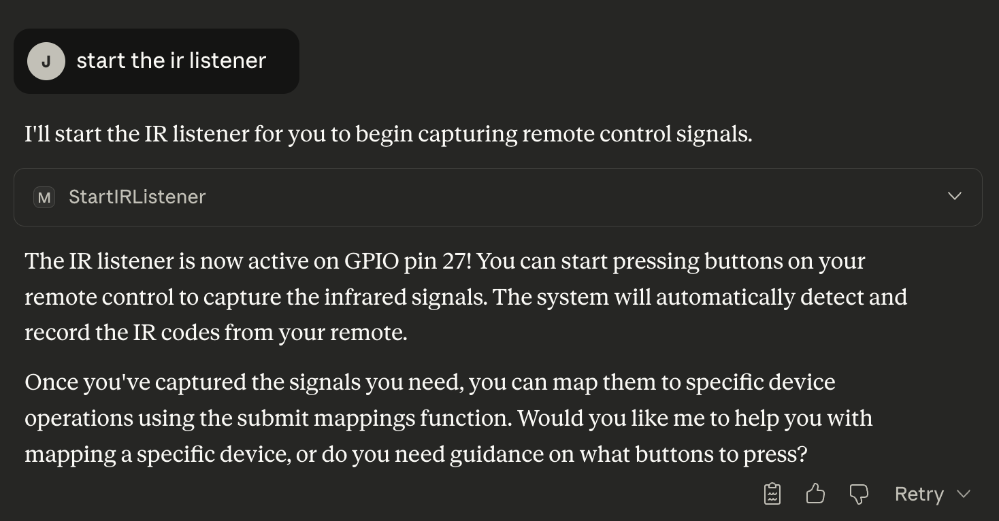
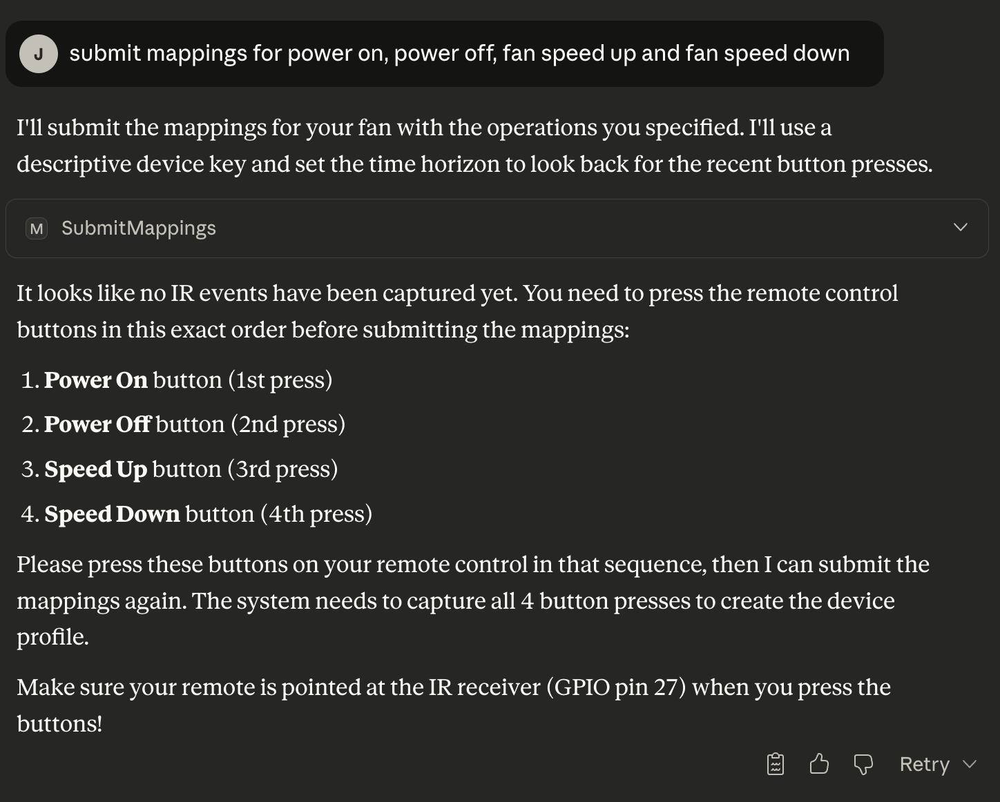
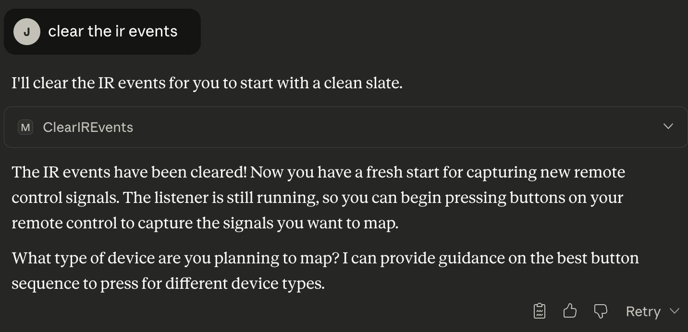
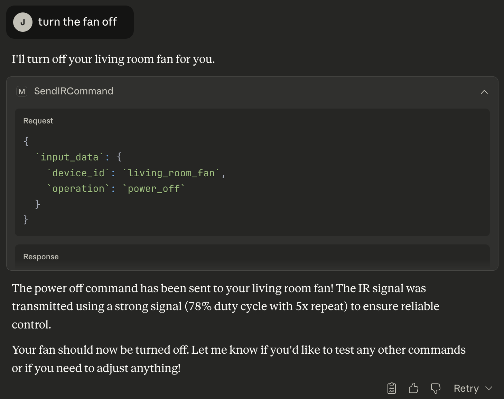

# Raspberry Pi MCP Server Setup Guide

## Prerequisites

- Raspberry Pi 4 (arm64)
- IR receiver connected to GPIO 27
- IR LED transmitter connected to GPIO 17
- Raspberry Pi OS installed with SSH enabled

## Initial Setup

### 1. Configure Raspberry Pi

```bash
# Enable Avahi for .local hostname resolution, so we can connect with ssh to the pi without using the ip address
sudo apt install -y avahi-daemon
sudo systemctl enable avahi-daemon
sudo systemctl start avahi-daemon

# Install and start pigpio daemon (required for IR timing)
sudo apt install -y pigpio
sudo systemctl enable pigpiod
sudo systemctl start pigpiod
```

### 2. Development Environment Setup

```bash
# On your local machine
pipx install uv
uv python pin 3.12
uv sync --python 3.12
```

## Deployment Options

### Docker Deployment

Build and deploy the containerized server:

```bash
# Set your Pi password
export PI_PASSWORD='your_password'

# Deploy using the provided script, default image name in script is mcppi:v2
./deploy.sh
```

The deployment script handles:
- Building ARM64 Docker image using dockerx
- Transferring to Raspberry Pi via ssh
- Starting container with privileged access for GPIO

## Device Registration Workflow

Interact with the MCP server using natural language through your MCP client (e.g., Claude Desktop). The server exposes tools that can be called conversationally.

### 1. Plan Device Operations

Ask the MCP to get mapping guidance for your device type. This calls the `GetMappingGuidance` tool:

"What operations should I map for a fan?"

Returns suggested operations like `speed_up`, `speed_down`, `power_on`, etc.

### 2. Start IR Listener

Tell the MCP to start listening for IR signals. This calls the `StartIRListener` tool:

"Start the IR listener"

The listener automatically monitors GPIO 27 and captures signal timing data.



### 3. Capture IR Signals

Press buttons on your remote in this order:
1. Required operations first: `power_on`, `power_off`
2. Optional operations next: `speed_up`, `speed_down`, etc.

The signals should automatically be received

### 4. Register Device Mappings

Instruct the MCP to register your device with the captured signals in the order the buttons were pressed. This calls the `SubmitMappings` tool:

"Submit the mappings for the living room fan, I pressed power on, power off, speed up, and speed down in the last 2 minutes."

The tool matches captured signals to operations in chronological order. Device configuration is saved to `/home/pi/.raspberry-mcp/devices.json`.



### 5. Clear IR Events

There is also an option to clear IR events if we want to start fresh and start listening again.

"Clear the IR events" will clear the events from the IR listener



## Device Control

Once devices are registered, control them through natural language commands to the MCP.

### Send Commands

Tell the MCP to control your device. This calls the `SendIRCommand` tool:

"Turn on the living room fan"

Transmits IR signal via GPIO 17 at 38kHz with 78% duty cycle, repeated 5x for reliability.



### List Available Operations

Ask the MCP what operations are available. This calls the `ListDeviceOperations` tool:

"What can I do with the living room fan?"

### Troubleshoot IR Issues

Request troubleshooting if commands aren't working. This calls the `TroubleshootIR` tool:

"Troubleshoot the power_on command for the living room fan"

Tests different power levels and frequencies to identify transmission issues.

## Architecture Overview

### Core Components

- `IRListenerManager`: Singleton service handling IR signal capture using pigpio callbacks with hardware-precise timing
- `ir_event_controls.py`: IR transmission functions supporting NEC, Sony, and generic protocols
- `device_registry.py`: Device configuration persistence

### Signal Processing

1. GPIO callback captures pulse timing data
2. Signal completion detected after 200ms timeout
3. Protocol detection (NEC/Sony) or generic hash-based encoding
4. Storage with normalized timing patterns for replay

### MCP Integration

- `server.py`: FastMCP server with HTTP transport
- `ToolService`: Automatic tool registration and schema generation
- CORS enabled for cross-origin access

## Verification

Ask the MCP to check the listener status to verify signal capture:

"What's the status of the IR listener?"

Request a transmitter test to verify hardware functionality:

"Test the IR transmitter"

## Notes

- All IR timing uses pigpio for microsecond precision
- Docker container requires `--privileged` flag for GPIO access
- Device mappings persist across restarts
- Pattern matching temporarily disabled to prevent false positives
